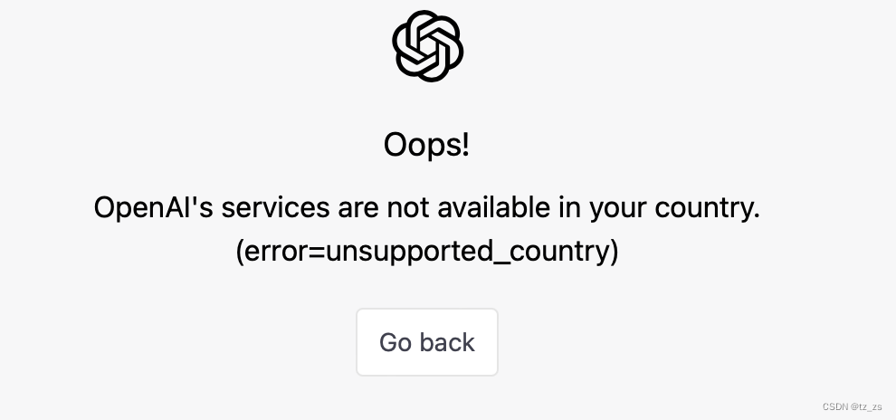

____tz_zs

# 【2023-01-04】Too many requests in 1 hour. Try again later.
```
Too many requests in 1 hour. Try again later.
```
对于国内用户，大概率是因为所用的代理的ip段有太多的人使用ChatGPT。
### 方法
切换一个新代理。
### 我的解决方式
从原来的`搬瓦工洛杉矶服务器`切换到了`韩国或者美国的新代理`，刷新即可。

# [2023-02-15] Oops!OpenAI's services are not available in your country. (error=unsupported_country)
```
Oops!
OpenAI's services are not available in your country. (error=unsupported_country)
```



不使用代理、或者使用香港代理，登录时会出现这个报错。实测韩国和美国的代理都能用。记得清空一下浏览器缓存。


# [2023-02-15] Access denied You do not have access to chat.openai.com.
```
Access denied
You do not have access to chat.openai.com.

The site owner may have set restrictions that prevent you from accessing the site.
```
有些代理因为用的人太多了，已经被拦截。清空一下浏览器缓存，然后切换新的、用的人少的代理服务器。

# 参考
https://www.reddit.com/r/ChatGPT/comments/zm9g0n/too_many_requests_in_1_hour_try_again_later/